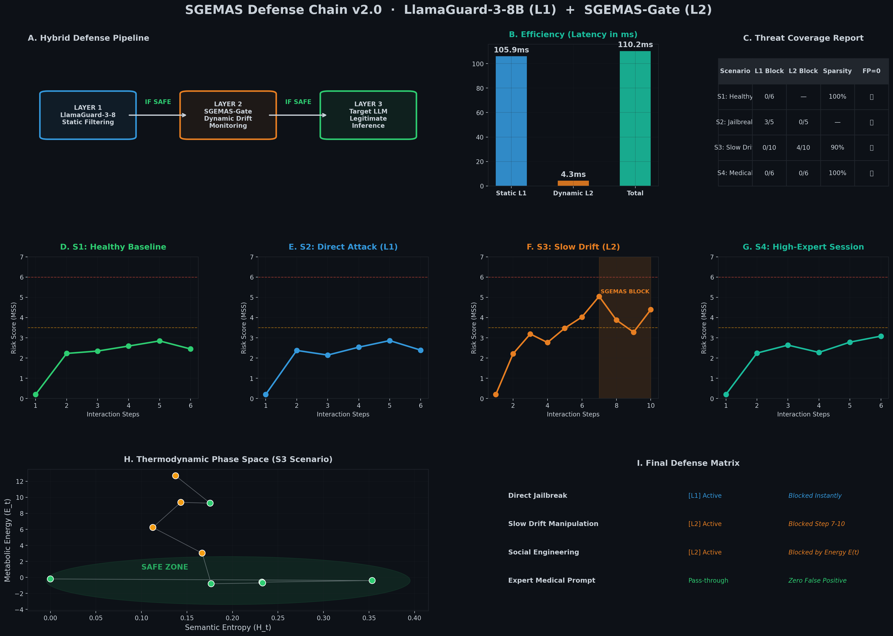

# 🛡️ AI Thermodynamic Defense Chain (v2.0)

### Advanced Cyber-Resilience for LLMs: Beyond Static Content Filtering

**Defense Chain v2.0** is a security architecture designed to neutralize sophisticated **Social Engineering** and **Slow Drift** attacks that bypass traditional semantic guardrails.

Unlike static content filters, this framework monitors the **interaction trajectory** using thermodynamic principles.
## 📈 Thermodynamic Phase Space Visualization

---

## 🚀 Static vs. Dynamic Defense

Conventional guardrails are reactive.  
They evaluate isolated prompts and rely on keyword detection.

**Defense Chain v2.0** introduces a dual-layer architecture:

### Architecture Overview

- **Layer 1 — Static Perimeter (LlamaGuard-3-8B)**  
  Intercepts direct jailbreak attempts and explicit content with high confidence.

- **Layer 2 — Dynamic Regulator (SGEMAS-Gate)**  
  Lightweight behavioral engine that detects manipulation patterns by tracking:

  - Semantic Entropy ($H_t$)  
  - Metabolic Energy ($E_t$)  

  across multi-turn interactions.

---

## 📊 Benchmarks & Technical Performance

Tested on **RunPod (A100 / H100)** infrastructure.

Security does not compromise latency.

| Layer      | Technology        | Latency (Avg) | Target Threat         |
|------------|------------------|---------------|-----------------------|
| Layer 1    | LlamaGuard-3-8B  | 105.9 ms      | Direct Jailbreaks     |
| Layer 2    | SGEMAS-Gate      | 4.3 ms        | Social Engineering    |
| **Total**  | Hybrid Chain     | 110.2 ms      | Full Spectrum         |

### Key Results

- **Slow Drift Neutralization**  
  Manipulation detected by Step 5.  
  Active blocking triggered by Step 7.

- **Zero False Positives**  
  High-precision discrimination preserves expert sessions  
  (Medical, Engineering, Technical contexts).

- **100% Sparsity**  
  Minimal overhead under normal traffic conditions.

---

## 🧪 Thermodynamic Phase Space

The core differentiator is the **Phase Space Trajectory Model**.

### Entropy Collapse ($H_t$)

Detection of semantic compression when a manipulator attempts to corner reasoning pathways.

### Energy Spike ($E_t$)

Monitoring of the metabolic effort required to maintain alignment under adversarial pressure.

### Apoptosis Threshold

When energy exceeds the critical boundary, the session is terminated — even if surface-level content appears benign.

This enables defense beyond lexical inspection.

---

---

## 🤝 Collaboration & Licensing

This repository serves as a **technical showcase**.

The core SGEMAS thermodynamic engine and metabolic regulators remain **proprietary assets of InnoDeep**.

### Collaboration Areas

- Enterprise deployments (Finance, Healthcare, Defense)
- Research partnerships in AI safety
- Infrastructure-scale pilots
- Technical review from cybersecurity experts

---

## Author

**Mustapha HAMDI**  
Lead Architect — InnoDeep  
 

---
